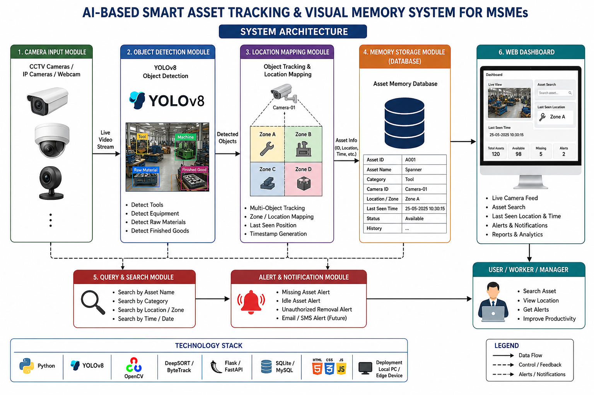

# AI-Based Smart Asset Tracking for MSMEs
### Digital Memory Map System: AI-Based Smart Asset Tracking & Visual Memory System

An AI-powered visual asset tracking system for Micro, Small and Medium Enterprises (MSMEs). Using existing CCTV cameras or webcams, **YOLOv8** detects tools, raw materials, equipment and finished goods. Each asset's **last known location and timestamp** are stored in a database so workers can find anything in seconds.

> Case study / project documentation. The full presentation is in [`docs/`](docs/).

---

## Team

| Name | Student ID |
|------|-----------|
| Dinesh Kumar C | CB2316 |
| Lukman Ahamed M | CB2331 |
| Sarukesh J | CB2350 |

---

## Problem Statement

- Misplaced tools delay production.
- Manual inventory tracking causes errors.
- Existing RFID/GPS solutions need extra hardware and are expensive.
- MSMEs need an affordable, AI-based asset tracking solution.

## Proposed Solution

A computer-vision system that builds a **visual memory** of the factory floor:

1. Cameras continuously monitor work areas.
2. YOLOv8 detects industrial assets.
3. The system stores asset name, location (zone) and timestamp.
4. A user searches for an asset.
5. The dashboard instantly shows its last seen location.

## Key Features

- Detection of tools, equipment, raw materials and finished goods
- Zone-based location mapping and last-seen timestamp
- Search by asset name, category, location/zone, or time/date
- Web dashboard with live camera feed, asset search and analytics
- Alerts: missing asset, idle asset, unauthorized removal (email/SMS planned)
- No RFID tags needed, so it works as a low-cost Industry 4.0 retrofit

## System Architecture



```
Camera Input
     |
YOLOv8 Object Detection
     |
Location Mapping
     |
Asset Database
     |
Web Dashboard & Alerts
```

### Modules

| # | Module | Folder |
|---|--------|--------|
| 1 | Camera Input Module | `backend/` |
| 2 | Object Detection Module (YOLOv8) | `backend/` |
| 3 | Location Mapping Module | `backend/` |
| 4 | Memory Storage Module (Database) | `database/` |
| 5 | Query & Search Module | `backend/` |
| 6 | Web Dashboard | `frontend/` |

## Technology Stack

| Layer | Technology |
|-------|-----------|
| Language | Python |
| Detection | YOLOv8, OpenCV |
| Tracking | DeepSORT / ByteTrack |
| Backend API | Flask / FastAPI |
| Database | SQLite / MySQL |
| Frontend | HTML, CSS, JavaScript |
| Deployment | Local PC / Edge device |

## Repository Structure

```
smart-asset-tracking-msmes/
├── README.md
├── docs/          # Presentation + architecture diagram
├── frontend/      # Web dashboard (HTML, CSS, JS)
├── backend/       # YOLOv8 detection, tracking, Flask API
├── database/      # SQL schema and data design
└── .gitignore
```

Each folder has its own README with details.

## Quick Start (demo without a camera)

```bash
git clone https://github.com/YOUR-USERNAME/smart-asset-tracking-msmes.git
cd smart-asset-tracking-msmes/backend
pip install -r requirements.txt
python seed_demo.py
python app.py
```

Open http://127.0.0.1:5000 to see the dashboard. For live camera detection, see [`backend/README.md`](backend/README.md).

## Applications

Manufacturing industries, warehouses, automotive workshops, tool rooms, electronics assembly units.

## Advantages

Low-cost retrofit, no RFID tags, reduced search time, improved productivity, real-time monitoring, easy integration.

## Future Scope

Mobile application, voice-based search, predictive asset movement, multi-camera tracking, ERP integration.

## Conclusion

The system enables MSMEs to digitally track industrial assets using AI and Computer Vision, supports Industry 4.0 adoption, improves operational efficiency, and can be developed into a commercially viable prototype.

## Documentation

- Presentation: [`docs/AI_Based_Smart_Asset_Tracking_for_MSMEs_Detailed50.pptx`](docs/AI_Based_Smart_Asset_Tracking_for_MSMEs_Detailed50.pptx)
- Architecture diagram: [`docs/architecture.png`](docs/architecture.png)
